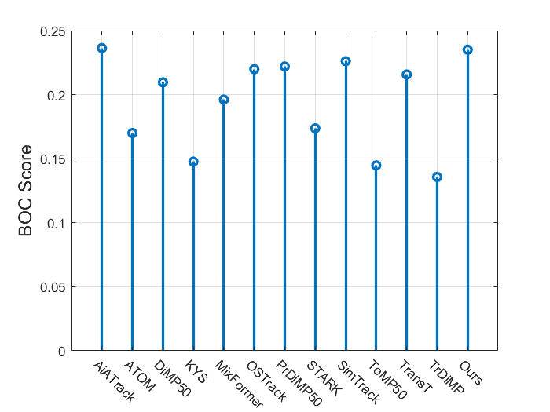

<div align="center">


  
**The First High Definition (HD) Event based Visual Object Tracking Benchmark Dataset** 

------

<p align="center">
  • <a href="">arXiv</a> • 
  <a href="">Baselines</a> •
  <a href="">DemoVideo</a> • 
  <a href="">Tutorial</a> •
</p>

</div>

> **Event Stream-based Visual Object Tracking: A High-Resolution Benchmark Dataset and A Novel Baseline.** Xiao Wang, Shiao Wang, Chuanming Tang, Lin Zhu, Bo Jiang, Yonghong Tian, Jin Tang (2023). arXiv preprint arXiv:2309.14611.
[[Paper](https://arxiv.org/abs/2309.14611)]
[[Code](https://github.com/Event-AHU/EventVOT_Benchmark)]
[[DemoVideo](https://youtu.be/FcwH7tkSXK0?si=GHOG7rfw4-GFd9dz)] 


# :dart: Abstract 
Tracking using bio-inspired event cameras draws more and more attention in recent years. Existing works either utilize aligned RGB and event data for accurate tracking or directly learn an event-based tracker. The first category needs more cost for inference and the second one may be easily influenced by noisy events or sparse spatial resolution. In this paper, we propose a novel hierarchical knowledge distillation framework that can fully utilize multi-modal / multi-view information during training to facilitate knowledge transfer, enabling us to achieve high-speed and low-latency visual tracking  during testing by using only event signals. Specifically, a teacher Transformer  based multi-modal  tracking framework is first trained  by feeding the RGB frame and event stream simultaneously. Then, we design a new hierarchical knowledge distillation strategy which includes pairwise similarity, feature representation and response maps based knowledge distillation to guide the learning of the student Transformer network. Moreover, since existing event-based tracking datasets are all low-resolution ($346 \times 260$), we propose the first large-scale high-resolution ($1280 \times 720$) dataset named EventVOT. It contains 1141 videos and covers a wide range of categories such as pedestrians, vehicles, UAVs, ping pongs, etc. Extensive experiments on both low-resolution (FE240hz, VisEvent, COESOT), and our newly proposed high-resolution EventVOT dataset fully validated the effectiveness of our proposed method. 


# :collision: Update Log 

* [2024.02.27] Our work is accepted by CVPR-2024! 
* [2023.09.26] arXiv paper, dataset, pre-trained models, and benchmark results are all released [[arXiv](https://arxiv.org/abs/2309.14611)]
* [2023.12.04] EventVOT_eval_toolkit, from [EventVOT_eval_toolki (Passcode：wsad)](https://pan.baidu.com/s/1rDsLIsNLxN6Gh9u-EdElyA?pwd=wsad)


# :video_camera: Demo Video
A demo video [Youtube](https://youtu.be/FcwH7tkSXK0?si=GHOG7rfw4-GFd9dz) can be found by clicking the image below: 
<p align="center">
  <a href="https://youtu.be/FcwH7tkSXK0">
    
  </a>
</p> 

<p align="center">
  
</p>


# :hammer: Environment 

**A distillation framework for Event Stream-based Visual Object Tracking.**

[[HDETrack_S_ep0050.pth](https://pan.baidu.com/s/1GigDXtkSd9oE04dUM3W6Nw?pwd=wsad)] Passcode：wsad

[[Raw Results](https://pan.baidu.com/s/1vkC8fNisBqmIPjXzWvveWA?pwd=wsad)] Passcode：wsad


<p align="center">
  
</p>

Install env
```
conda create -n hdetrack python=3.8
conda activate hdetrack
bash install.sh
```

Run the following command to set paths for this project
```
python tracking/create_default_local_file.py --workspace_dir . --data_dir ./data --save_dir ./output
```

After running this command, you can also modify paths by editing these two files
```
lib/train/admin/local.py  # paths about training
lib/test/evaluation/local.py  # paths about testing
```

Then, put the tracking datasets EventVOT in `./data`. 

Download pre-trained [MAE ViT-Base weights](https://pan.baidu.com/s/1M1_CPXgH3PHr7MwXP-G5VQ?pwd=wsad) and put it under `$/pretrained_models`

Download teacher pre-trained [CEUTrack_ep0050.pth](https://pan.baidu.com/s/1Z6jA6bnoY8sBSbRsxaEo4w?pwd=wsad) and put it under `$/pretrained_models`

Download the trained model weights from [[HDETrack_S_ep0050.pth](https://pan.baidu.com/s/1GigDXtkSd9oE04dUM3W6Nw?pwd=wsad)] and put it under `$/output/checkpoints/train/hdetrack/hdetrack_eventvot` for test directly.


## Train & Test
```
# train
python tracking/train.py --script hdetrack --config hdetrack_eventvot --save_dir ./output --mode single --nproc_per_node 1 --use_wandb 0

# test
python tracking/test.py hdetrack hdetrack_eventvot --dataset eventvot --threads 1 --num_gpus 1
```


### Test FLOPs, and Speed
*Note:* The speeds reported in our paper were tested on a single RTX 3090 GPU.


# :dvd: EventVOT Dataset 


* **Event Image version** (train.zip 28.16GB, val.zip 703M, test.zip 9.94GB)

:floppy_disk: **Baidu Netdisk**: link：https://pan.baidu.com/s/1NLSnczJ8gnHqF-69bE7Ldg?pwd=wsad code：wsad


* **Complete version** (Event Image + Raw Event data, train.zip 180.7GB, val.zip 4.34GB, test.zip 64.88GB)
  
:floppy_disk: **Baidu Netdisk**: link：https://pan.baidu.com/s/1ZTX7O5gWlAdpKmd4R9VhYA?pwd=wsad code：wsad
  
:floppy_disk: **Dropbox**: https://www.dropbox.com/scl/fo/fv2e3i0ytrjt14ylz81dx/h?rlkey=6c2wk2z7phmbiwqpfhhe29i5p&dl=0

* If you want to download the dataset directly on the Ubuntu terminal using a script, please try this:
```
wget -O EventVOT_dataset.zip https://www.dropbox.com/scl/fo/fv2e3i0ytrjt14ylz81dx/h?rlkey=6c2wk2z7phmbiwqpfhhe29i5p"&"dl=1
```

The directory should have the below format:
```Shell
├── EventVOT dataset
    ├── Training Subset (841 videos, 180.7GB)
        ├── recording_2022-10-10_17-28-38
            ├── img
            ├── recording_2022-10-10_17-28-38.csv
            ├── groundtruth.txt
            ├── absent.txt
        ├── ... 
    ├── Testing Subset (282 videos, 64.88GB)
        ├── recording_2022-10-10_17-28-24
            ├── img
            ├── recording_2022-10-10_17-28-24.csv
            ├── groundtruth.txt
            ├── absent.txt
        ├── ...
    ├── validating Subset (18 videos, 4.34GB)
        ├── recording_2022-10-10_17-31-07
            ├── img
            ├── recording_2022-10-10_17-31-07.csv
            ├── groundtruth.txt
            ├── absent.txt
        ├── ... 
```


# :triangular_ruler: Evaluation Toolkit

1. Download the EventVOT_eval_toolkit from [EventVOT_eval_toolki (Passcode：wsad)](https://pan.baidu.com/s/1rDsLIsNLxN6Gh9u-EdElyA?pwd=wsad), and open it with Matlab (over Matlab R2020).
2. add your tracking results and [baseline results (Passcode：wsad)](https://pan.baidu.com/s/1xScOxwW_y2lzoXrYtJX-RA?pwd=wsad)  in `$/eventvot_tracking_results/` and modify the name in `$/utils/config_tracker.m`
3. run `Evaluate_EventVOT_benchmark_SP_PR_only.m` for the overall performance evaluation, including SR, PR, NPR.
4. run `plot_BOC.m` for BOC score evaluation and figure plot.
5. run `plot_radar.m` for attributes radar figrue plot.
6.  run `Evaluate_EventVOT_benchmark_attributes.m` for attributes analysis and figure saved in `$/res_fig/`. 
<p align="center">
  
</p>

# :chart_with_upwards_trend: Benchmark Results
The overall performance evaluation, including SR, PR, NPR.

<p align="left">
  
</p>


# :cupid: Acknowledgement 
* Thanks for the  [CEUTrack](https://github.com/Event-AHU/COESOT), [OSTrack](https://github.com/botaoye/OSTrack), [PyTracking](https://github.com/visionml/pytracking) and [ViT](https://github.com/rwightman/pytorch-image-models) library for a quickly implement.

# :newspaper: Citation 
```bibtex
@article{wang2023eventvot,
  title={Event Stream-based Visual Object Tracking: A High-Resolution Benchmark Dataset and A Novel Baseline},
  author={Xiao Wang, Shiao Wang, Chuanming Tang, Lin Zhu, Bo Jiang, Yonghong Tian, Jin Tang},
  journal={arXiv:2309.14611},
  url={https://arxiv.org/abs/2309.14611}, 
  year={2023}
}
```


